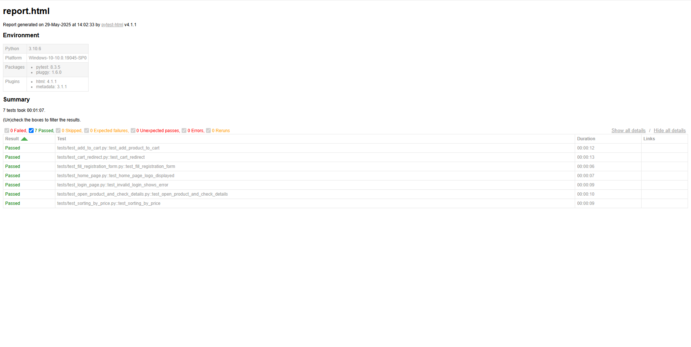

# 🛒 UI Tests for Magento Luma — Selenium + Pytest


Pet-проект по UI-тестированию демо-магазина [Magento Luma](https://magento.softwaretestingboard.com)  
с использованием `Selenium`, `Pytest`, `Page Object` и `pytest-html`.

---

## ✅ Покрытие тестами

- 🔍 Проверка отображения логотипа на главной странице
- 🛒 Добавление товара в корзину
- 🧾 Переход в корзину после добавления товара
- 🧍‍♂️ Ввод данных при регистрации
- 🚫 Неверный логин и появление ошибки
- 📦 Открытие товара и проверка: заголовок, цена, размер
- 📉 Сортировка товаров по цене

---

## 📁 Структура проекта

```
ui_tests_shop/
├── pages/                  # Page Object классы
│   ├── base_page.py
│   ├── home_page.py
│   ├── product_page.py
│   ├── catalog_page.py
│   └── ...
├── tests/                  # UI-тесты (pytest)
│   ├── test_add_to_cart.py
│   ├── test_cart_redirect.py
│   ├── test_fill_registration_form.py
│   └── ...
├── screenshots/            # Скриншоты при падении тестов
├── report.html             # HTML-отчёт (pytest-html)
├── report_preview.png      # Превью отчёта для README
├── conftest.py             # Фикстура для драйвера
├── requirements.txt
└── README.md
```

---

## 🚀 Запуск

```bash
git clone https://github.com/TomOstin/ui_tests_shop.git
cd ui_tests_shop
python -m venv .venv
.venv\Scripts\activate
pip install -r requirements.txt
```

### ▶️ Запуск тестов

```bash
pytest tests/
```

С HTML-отчётом:

```bash
pytest tests/ --html=report.html
```

---

## 🧪 Пример теста

```python
def test_add_product_to_cart(driver):
    home = HomePage(driver)
    home.open_home_page()
    home.navigate_to_jackets()

    product = ProductPage(driver)
    product.open_first_product()
    product.add_to_cart()

    success = product.get_success_message()
    assert "You added" in success and "to your shopping cart." in success
```

---

## 🧾 Пример отчёта



---

## ⚙️ Стек технологий

- Python 3.10+
- Selenium WebDriver
- Pytest + pytest-html
- Page Object Pattern

---

## 👨‍💻 Автор

**Tom Ostin**  
Python-разработчик, UI/QA инженер  
[GitHub: TomOstin](https://github.com/TomOstin)  
[Telegram: @tom_ostin](https://t.me/tom_ostin)